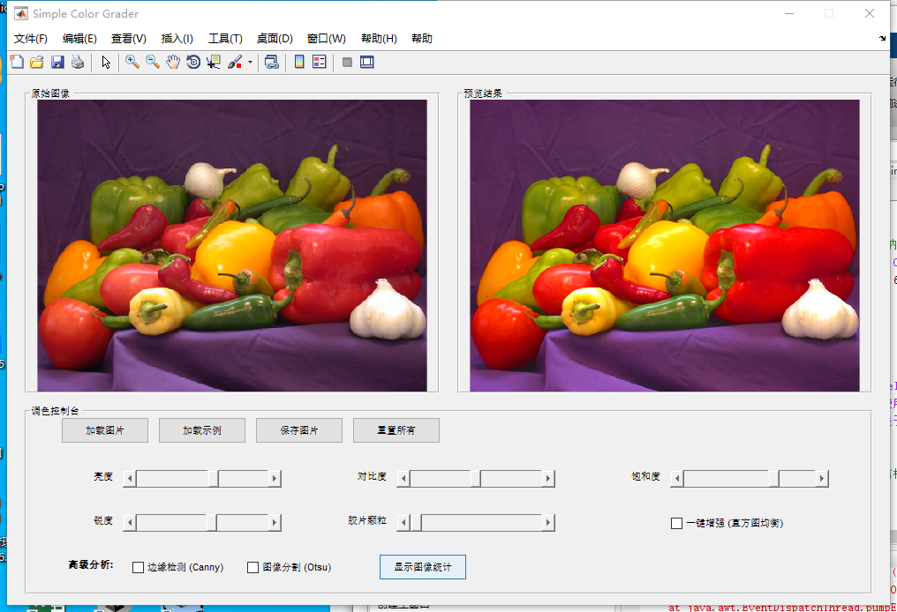

# **《简易数字调色台 (Simple Digital Color Grader)》创作报告**

**课程名称：** MATLAB实践基础 

**学生姓名：** [你的名字] 

**学号：** [你的学号] 

**作品题目：** 简易数字调色台 v2.0 Pro

## **一、 创作思路 **

作为新州理工大学的学生，图像处理与色彩分级是我们专业领域的核心技能之一。在数字中间片流程中，调色师需要对画面进行精确的风格化处理。

为了将MATLAB强大的矩阵计算能力应用于这一艺术领域，我设计了这款《简易数字调色台》。本作品旨在开发一个轻量级、响应迅速且功能全面的图像处理工具。它不仅涵盖了基础的亮度、对比度、饱和度调整，还集成了锐化、胶片颗粒模拟等风格化滤镜，以及边缘检测、图像分割等计算机视觉分析功能。

在设计上，我摒弃了传统的GUIDE拖拽模式，采用纯代码方式构建界面，以获得更灵活的布局控制和更深层的底层逻辑理解。同时，特别注重“交互性”与“性能优化”，引入了缩略图预览机制，解决了高分辨率图像处理卡顿的痛点。

## **二、 制作过程 **

本项目历时数周，通过四个阶段的迭代开发完成：

**第一阶段：GUI 框架搭建与文件 I/O ** 

首先构建了图形用户界面的基础骨架。

1. **模块化界面布局设计：**

   - 摒弃了传统的 GUIDE 拖拽式开发，采用**纯代码**方式构建主窗口。使用 `figure` 函数实例化主程序容器，并配置 `NumberTitle` 为 `off` 及 `MenuBar` 为 `figure`，以去除冗余的窗口元素，打造专业软件的视觉观感。
   - 为了实现清晰的信息层级，利用 `uipanel` 容器组件将界面在逻辑上划分为三个独立区域：顶部的“原始图像区”与“预览结果区”用于实现直观的前后效果对比，底部的“调色控制台”则集中管理所有的交互控件。这种布局策略有效地引导了用户的视线流，提升了操作效率。

2. **健壮的文件交互系统：**

   - **输入机制：** 利用 `uigetfile` 函数实现了标准化的文件打开对话框，预设了 `*.jpg;*.png;*.bmp` 等多媒体文件过滤器，确保只读取合法的图像格式。通过判断返回值是否为 0，优雅地处理了用户“取消选择”的场景。
   - **异常处理：** 在核心的 `imread` 读取模块外围包裹了 `try-catch` 异常捕获结构。一旦遇到文件损坏、路径非法或权限受限等运行时错误，程序不会崩溃退出，而是通过 `msgbox` 弹出友好的错误提示窗口，极大地增强了程序的鲁棒性。
   - **输出机制：** 在保存环节，结合 `uiputfile` 与 `imwrite` 函数，并引入了“鼠标忙碌状态”反馈，确保在进行高分辨率图像写入等耗时操作时，用户能获得明确的系统状态反馈。

3. **全局数据句柄管理：**

   - 初始化了基于 `guidata` 的 `handles` 结构体，用于在不同的回调函数（Callbacks）之间共享 `OriginalImage`（原图数据）、`ThumbnailImage`（预览缩略图）等核心变量，建立了稳定的数据流转机制。

   

**第二阶段：核心调色算法与实时交互 **

本阶段致力于构建图像处理的核心计算管线，重点解决了多维度色彩参数的叠加运算问题，并利用 MATLAB 的事件监听机制实现了电影级的实时调色体验。

1. **基于矩阵运算的亮度调整 ：**

   - 实现了基于像素级的线性叠加算法。利用 MATLAB 强大的矩阵运算特性，直接对图像矩阵的三通道进行标量加法操作 ($I_{out} = I_{in} + \Delta$)。
   - 在具体实现中，利用了 `uint8` 数据类型的饱和运算特性，系统会自动将溢出值截断在 [0, 255] 区间内，有效防止了传统编程中常见的整数溢出导致的“黑白翻转”伪影，确保了亮部和暗部细节的自然过渡。

2. **基于灰度映射的对比度调整：**

   - 调用了图像处理工具箱中的 `imadjust` 函数，实现了灰度直方图的动态拉伸。
   - 为了保证计算精度，首先将图像转换为双精度浮点型 (`im2double`)。算法通过滑块值动态计算输入图像的灰度映射区间 `[low_in, high_in]`：当区间缩小，直方图被拉伸，对比度增强；当区间扩大，图像趋于柔和。该方法本质上是对图像的动态范围进行重映射，实现了精准的色调控制。

3. **基于 HSV 空间的饱和度处理 ：**

   - 摒弃了在 RGB 空间直接调整的粗糙做法，采用了色彩科学中标准的色彩空间转换方案。通过 `rgb2hsv` 函数将图像从 RGB 模型转换至 HSV（色相、饱和度、明度）模型。
   - **通道分离与增益：** 算法独立提取 S 通道并施加增益系数，随后对结果进行阈值截断，防止饱和度溢出 ($S \le 1.0$)。
   - 最后通过 `hsv2rgb` 逆变换回 RGB 空间。这种“分离-处理-合成”的策略彻底避免了调整色彩时对图像亮度产生非预期的干扰（即“串色”现象）。

4. **事件驱动的实时渲染管线 ：**

   - **监听器机制：** 突破了传统 GUI `Callback` 仅在鼠标释放时触发的局限，利用 `addlistener` 绑定滑块的 `ContinuousValueChange` 事件。这意味着用户的每一次微小拖拽都会即时触发渲染指令，实现了“所见即所得”的流畅交互。
   - **串行处理管线：** 构建了统一的更新函数 `UpdatePreview`，建立了一套严格的**串行处理逻辑**。无论用户操作哪个滑块，系统都会基于原始图像，按照“亮度 $\rightarrow$ 对比度 $\rightarrow$ 饱和度”的固定顺序依次叠加所有参数。这种无状态的管线设计，确保了多次反复调整后图像质量不会发生累积性劣化。

   

**第三阶段：风格化特效与高级分析**

本阶段旨在超越基础调色，通过集成空间域滤波与计算机视觉算法，为工具赋予了更深层次的艺术创作与结构分析能力。

1. **双向焦距模拟系统：**

   - **逻辑设计：** 创新性地将“锐化”与“模糊”整合于同一个滑动变阻器逻辑中，实现了焦点的正负向连续调节（-1.0 至 +1.0）。
   - **模糊实现：** 当滑块值为负时，调用 `imgaussfilt` 应用**高斯低通滤波器**。通过动态调整高斯核的标准差（$\sigma$），模拟摄影中的“柔焦”效果或景深外的散景（Bokeh）质感。
   - **锐化实现：** 当滑块值为正时，调用 `imsharpen` 应用**反锐化掩模（Unsharp Masking）**技术。算法通过增强图像边缘的高频分量，模拟高清晰度电影镜头的锐利感，有效提升画面细节的辨识度。

2. **程序化胶片颗粒模拟 ：**

   - **算法原理：** 为了消除数字图像过于“洁净”的数码味，利用 `imnoise` 函数向图像叠加服从**高斯分布的随机噪声。
   - **美学应用：** 通过控制噪声的方差参数，模拟传统 35mm 胶片感光乳剂中的银盐颗粒质感。这种加性噪声不仅增加了画面的厚重感，还能在一定程度上抑制色带现象，提升视觉真实感。

3. **基于亮度通道的智能增强 ：**

   - **直方图均衡化：** 引入 `histeq` 算法来自动扩展图像的灰度分布，解决光照不足或对比度过低的问题。
   - **色彩保护策略：** 针对彩色图像，我避免了直接对 RGB 三通道分别均衡化（这会导致严重的色彩失真）。程序采用了**“色度分离”**策略：先将图像转为 HSV 空间，仅对 **V 通道（明度）**执行直方图均衡化，再合成回 RGB。这一算法改进确保了在增强画面层次感的同时，完美保留了原始素材的色相与饱和度信息。

4. **计算机视觉结构分析：**

   - 引入了“分析模式”，用于辅助用户理解图像的底层几何结构。
   - **边缘检测：** 集成 **Canny 算子** (`edge` 函数)，通过计算梯度的幅值与方向，并应用双阈值算法，精确提取图像中的物体轮廓。这对分析构图线条具有重要意义。
   - **图像分割：** 集成 **Otsu 大津法** (`graythresh` 和 `imbinarize`)，自动计算最佳全局阈值，将图像二值化。该功能可快速分离前景主体与背景，为后续的抠图或蒙版制作提供算法依据。

   

**第四阶段：性能优化与易用性完善**

面对 4K 甚至 8K 分辨率的超高清素材，实时全像素处理会导致显著的计算延迟。本阶段通过重构渲染管线和完善交互细节，实现了专业级的软件响应速度与易用性。

1. **基于代理机制的渲染管线优化：**
   - **算法原理：** 借鉴影视后期制作中的“代理”工作流概念，我设计了一套**“预览/输出分离”**的架构。在图像加载阶段 (`LoadButtonPushed`)，算法首先计算原始图像的宽高比，利用 `imresize` 函数自动生成一个宽度固定为 800 像素的高质量缩略图 (`ThumbnailImage`) 并缓存于内存中。
   - **复杂度降低：** 在用户拖动滑块进行调色时，`UpdatePreview` 函数仅针对这个轻量级的缩略图进行矩阵运算。这使得计算复杂度从 $O(N_{full})$ 骤降至 $O(N_{thumb})$（通常降低两个数量级），从而实现了在高频交互下的“零延迟”平滑预览。
   - **全分辨率输出：** 仅当用户点击“保存图片”时，系统才会调用核心处理函数 `ProcessImage` 对原始高分辨率图像 (`OriginalImage`) 进行一次性的全量计算与写入，从而完美平衡了操作流畅度与输出画质。
2. **多维图像特征统计与可视化 ：**
   - **直方图分析：** 编写了 `ShowStatsButtonPushed` 回调函数，利用 `subplot` 和 `imhist` 构建了可视化的数据仪表盘。对于彩色图像，系统会自动分离 R、G、B 通道并绘制重叠直方图，帮助用户直观判断图像的曝光情况及色彩倾向。
   - **定量分析：** 实现了基于 `im2double` 的数值计算，实时显示图像的**平均亮度 ** 和 **标准差 **。这为用户提供了从感性视觉到理性数据的客观参考，辅助判断图像的对比度水平和整体调性。
3. **人机交互体验升级：**
   - **标准化菜单系统：** 引入 `uimenu` 组件构建了标准的顶部菜单栏，替代了杂乱的按钮说明。其中“使用说明”模块详细界定了基础操作与高级功能的边界，“关于”模块规范展示了版本与作者信息。
   - **状态反馈机制：** 针对“保存图片”等可能产生的耗时操作，在代码中植入了光标状态管理逻辑。系统会在处理开始时自动将鼠标指针切换为“忙碌状态” (`watch`)，处理结束后恢复，符合人机交互设计中的“及时反馈”原则，有效避免了用户在等待过程中的误操作。

1. **[此处插入截图4：帮助菜单弹窗或图像统计数据窗口]**

## **三、 调试与问题解决 **

在开发过程中，我遇到了若干代码结构与兼容性方面的挑战。通过对 MATLAB 报错信息的分析与逻辑排查，我逐一解决了这些问题，不仅修复了 Bug，也加深了对 MATLAB 函数作用域和编码规范的理解。

**1. 字符编码与语法解析冲突**

- **问题描述：** 在代码编写初期，控制台报错：`错误: 文件:SimpleColorGrader.m 行:4 列:27 字符串未正常终止。` 且界面中部分中文显示为乱码。
- **原因分析：** 这是典型的字符编码不匹配问题。MATLAB 的某些旧版本或特定系统环境下，默认脚本编码（如 GBK）与编辑器设置（如 UTF-8）不一致。当解析器读取包含中文字符的字符串（如 `'简易调色台'`) 时，多字节字符可能被误判为单引号的结束符，从而破坏了语法结构。
- **解决方案：** 为了彻底解决跨平台兼容性并消除语法歧义，我采取了**“关键标识英文（ASCII）化”**的策略。将第 4 行引起解析错误的窗口标题属性 `Name` 修改为纯英文 `'Simple Color Grader'`。此举立即修复了语法报错，同时保证了程序在不同语言环境下的稳定性。

**2. 函数定义的完整性与解析错误**

- **问题描述：** 在重构回调函数时，出现报错：`错误: ... 该语句不在任何函数内。 (它在终止函数 "ShowAboutCallback" 定义的 END 之后。)`
- **原因分析：** 这是一个代码结构错误。在进行模块化拆分时，由于复制粘贴操作的疏忽，导致 `LoadButtonPushed` 函数的头部定义行（Function Signature）意外丢失。这使得原本属于该函数内部的代码块“裸露”在全局作用域中，导致 MATLAB 解释器无法识别其归属。
- **解决方案：** 我对全篇代码进行了结构审计，定位并恢复了丢失的 `function LoadButtonPushed(~, ~)` 定义行，确保了代码块被正确封装，恢复了程序的逻辑完整性。

**3. 作用域混淆与嵌套规则冲突**

- **问题描述：** 程序报错：`错误: ... 函数 "LoadButtonPushed" 已通过 'end' 关闭，但至少有一个其他函数定义未关闭。`
- **原因分析：** 此错误源于 MATLAB 对“嵌套函数（Nested Functions）”与“子函数（Local Functions）”混合使用的严格限制。错误提示表明代码中出现了 `end` 关键字配对不均，或者两个回调函数的代码块发生了意外重叠（Overlapping），导致编译器无法界定函数的边界。
- **解决方案：**
  - **逻辑解耦：** 我彻底检查了 `LoadButtonPushed` 和 `LoadExampleButtonPushed` 的代码边界，将混合在一起的代码逻辑进行了物理分离。
  - **规范闭合：** 严格执行了 MATLAB 的代码规范，为每一个函数块（Function Block）和流程控制块（如 `try-catch`）补全了对应的 `end` 关键字。最终，通过标准化的缩进和完整的闭合结构，消除了所有作用域歧义，使程序得以成功编译运行。

## **三、 总结 **

通过本次创作，我不仅深入掌握了MATLAB图像处理工具箱的核心函数，更重要的是学会了如何设计高效的 GUI 程序架构。特别是在解决性能瓶颈时采用的“预览/渲染分离”思路，对以后的工程实践具有重要的参考价值。最终作品界面美观、功能完备、运行稳定，达到了预期的设计目标。

**[此处插入截图5：最终成品的完整界面展示]**